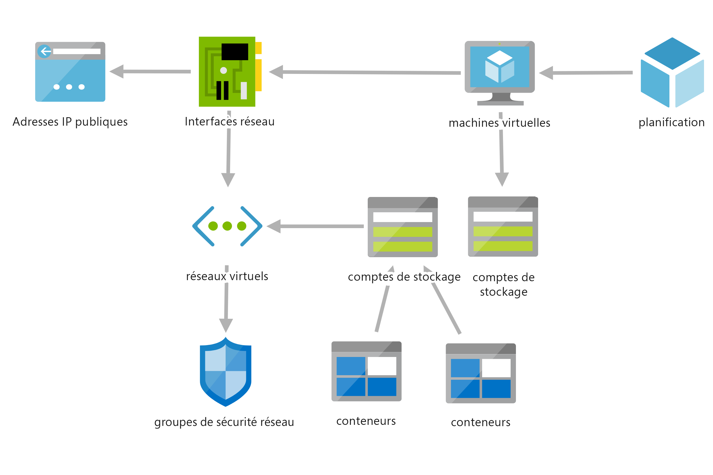

# <a name="pubsub-and-network-integration"></a>Pub/Sub et intégration réseau

## <a name="process-diagram"></a>Diagramme du processus


## <a name="overview"></a>Vue d’ensemble

L’objectif principal de ce défi est d’exposer les participants aux concepts suivants :

* Azure Functions Premium avec intégration au réseau virtuel
* Pub/Sub via des filtres d’abonnement et de rubriques Azure Service Bus (filtrage des événements nécessitant une action supplémentaire)
* Modèle de vérification de revendication de messagerie

## <a name="happy-path"></a>Façon de procéder idéale

* Le participant doit créer une rubrique Service Bus à laquelle envoyer des messages.
* Service Bus doit être configuré avec un point de terminaison privé connecté au réseau virtuel existant à l’aide du sous-réseau « pub-sub-messages ».
* Modifiez la fonction Azure utilisée dans le défi précédent pour publier des messages dans une nouvelle rubrique Service Bus **uniquement** s’il existe un ```receiptUrl``` dans les données reçues à partir d’Event Hub.
    * Utilisez l’élément UserProperties d’un type Message/BrokeredMessage Service Bus. La nouvelle propriété doit avoir une clé telle que « TotalCost » et une valeur telle que 134,59.  La propriété peut être utilisée par un filtre SQL Service Bus pour un abonnement.
    * Il est possible d’utiliser une liaison de sortie si vous utilisez C#.
    * Si vous utilisez JavaScript ou Java, utilisez le kit de développement logiciel (SDK) Azure.  Les liaisons ne fonctionneront pas (l’élément UserProperty n’est pas disponible et sera sérialisé dans le cadre du message).  Pour JavaScript, consultez un exemple [ici](https://docs.microsoft.com/azure/service-bus-messaging/service-bus-nodejs-how-to-use-topics-subscriptions-new-package#send-messages-to-a-topic).  Il s’agit d’un problème connu (voir [ici](https://github.com/Azure/azure-webjobs-sdk/issues/2137) et [ici](https://github.com/Azure/Azure-Functions/issues/1139)).
    * Si ce n’est déjà fait, mettez à niveau Azure Functions vers la version Premium Élastique.
    * Configurez la fonction Azure pour utiliser le sous-réseau « sale-processing » pour vous connecter et autoriser la connexion au Service Bus.
* Créez deux abonnements Service Bus, un pour gérer tous les messages et un pour gérer uniquement les messages dont le coût total est supérieur à 100 $.  
    * **Remarque :** l’ajout d’un filtre à un abonnement peut être effectué via le portail, uniquement après la création de l’abonnement, par le biais du panneau d’édition de l’abonnement. il peut également être créé à l’aide d’un modèle ARM ([ici](https://github.com/Azure/azure-quickstart-templates/blob/master/201-servicebus-create-topic-subscription-rule/azuredeploy.json) ou [ici](https://docs.microsoft.com/azure/service-bus-messaging/service-bus-resource-manager-namespace-topic-with-rule)), d’[Azure CLI](https://docs.microsoft.com/cli/azure/servicebus/topic/subscription/rule?view=azure-cli-latest), de code (SDK Azure) ou de [Service Bus Explorer](https://github.com/paolosalvatori/ServiceBusExplorer).
* Créez deux fonctions (au sein du plan Premium Functions) pour agir en tant qu’abonnés.  Il ne doit y avoir qu’une seule fonction par abonnement.
* Pour la fonction qui récupère et code en base64 le PDF :
    * Utilisez un déclencheur Service Bus pour recevoir le message.
    * Utilisez une liaison de sortie d’objet blob avec [une liaison de sortie d’objet blob pour un GUID aléatoire](https://docs.microsoft.com/azure/azure-functions/functions-bindings-expressions-patterns#create-guids) pour définir le nom de fichier.
    * L’élément receiptUrl doit être une référence à un objet blob Stockage Azure utilisant une URL SAS, et doit donc être téléchargeable dans la fonction Azure.
    * Configuré pour utiliser le sous-réseau « receipt-processing » pour autoriser la connexion au Service Bus.
* Utilisez la machine virtuelle fournie pour afficher les fichiers dans le stockage blob Azure et valider les messages envoyés à Service bus.  Accédez à distance à la machine virtuelle (à l’aide d’Azure Bastion), puis connectez-vous au portail Azure (à l’aide des informations d’identification Azure pour OpenHack).  Accédez à l’Explorateur Stockage dans le portail, puis parcourez l’arborescence pour afficher les fichiers dans le stockage blob.

## <a name="coachs-notes"></a>Notes du coach

* Notes sur la machine virtuelle (Jumpbox)
    * Utilisez Azure Bastion pour la connexion à la JumpBox.
    * *Nom d’utilisateur :* serverless
    * *Mot de passe :* Serverless4All!
    * La machine virtuelle s’arrêtera automatiquement à 19h00 UTC chaque jour.
* Les ressources Azure suivantes doivent être provisionnées à l’avance au sein de l’abonnement Azure du participant :
    * 2 comptes de stockage
        * Un pour les données de diagnostic de la machine virtuelle (le nom du compte de stockage doit commencer par « sohvmdiag »)
        * Un pour le stockage des reçus (le nom du compte de stockage doit commencer par « sohsales »).  Il doit y avoir deux conteneurs dans ce compte de stockage : « receipts » et « receipts-high-value ».
    * 1 machine virtuelle (soh-jumpbox)
        * Le système d’exploitation est Windows 10.
        * La machine virtuelle utilise une planification DevTestLab pour s’arrêter automatiquement tous les jours à 19h00 (aucune notification)
    * 1 hôte Azure Bastion
    * 1 réseau virtuel (« soh-vnet »)
        * 4 sous-réseaux
            * « receipt-processing » : pour une utilisation par la ressource de calcul (idéalement un plan Azure Functions Premium) utilisée pour traiter les messages du Service Bus pour ce défi
            * « sale-processing » : pour une utilisation par la ressource de calcul (dans l’idéal un plan Azure Functions Premium) utilisée pour mettre à jour le service de traitement des événements à partir du défi précédent pour une transmission à Service Bus
                * Si les hackers configurent les deux fonctions pour utiliser le même plan App Service, l’un des sous-réseaux ci-dessus peut être utilisé, car ils ont tous les deux la même configuration.
            * « pub-sub-messages » : cette valeur doit être utilisée par le Service Bus pour configurer les points de terminaison privés
            * « jumpbox » : pour une utilisation exclusivement par la machine virtuelle
            * « AzureBastionSubnet » : pour une utilisation par l’hôte Azure Bastion pour la connexion à la jumpbox
        * Les sous-réseaux receipt-processing sont configurés avec un point de terminaison de service de réseau virtuel pour l’accès aux ressources Microsoft.Storage.
        * 1 groupe de sécurité réseau pour autoriser l’accès à la jumbox via Azure Bastion

Le diagramme ci-dessous décrit les ressources Azure qui sont créées pour l’abonnement Azure de chaque équipe.



## <a name="why-service-bus-functions-virtual-machines-and-storage-accounts"></a>Pourquoi Service Bus, Functions, Machines virtuelles et Comptes de stockage

### <a name="service-bus"></a>Service Bus

* Gestion intégrale des messages d’entreprise avec les fonctionnalités de file d’attente de messages et Pub/Sub
* Découpler les actions et services les uns des autres pour l’équilibrage de charge, le routage sécurisé, le transfert des données et le contrôle dans les limites et la coordination du travail transactionnel avec un haut degré de fiabilité

### <a name="azure-functions"></a>Azure Functions

* Les fonctions Azure permettent à vos équipes d’écrire moins de code, de maintenir une infrastructure moins importante et de réduire les coûts.
* Les fonctions Azure sont légères et autonomes.  Les fonctions permettent de diviser facilement des applications monolithiques et de réduire vos délais/durées de cycle. Vos équipes peuvent donc faire passer le code en production de manière beaucoup plus rapide et efficace.

### <a name="azure-virtual-machines"></a>Machines virtuelles Azure

* Informatique à la demande, scalable et économique
* Aucune gestion du matériel, mais contrôle total sur la mise en réseau et l’accès, les systèmes d’exploitation, les disques et les configurations de processeur, comme le nombre de cœurs et la puissance de traitement

### <a name="azure-storage"></a>Stockage Azure

* Le stockage est durable, scalable et hautement disponible. La redondance garantit la sécurité de vos données en cas de défaillances matérielles temporaires, tout en étant massivement scalable pour répondre aux besoins des applications actuelles
* Le stockage est sécurisé, avec un chiffrement intégré et un contrôle d’accès affiné pour configurer un accès particulier et précis pour que les utilisateurs n’exposent que les données de stockage auxquelles ils doivent être autorisés à accéder.
